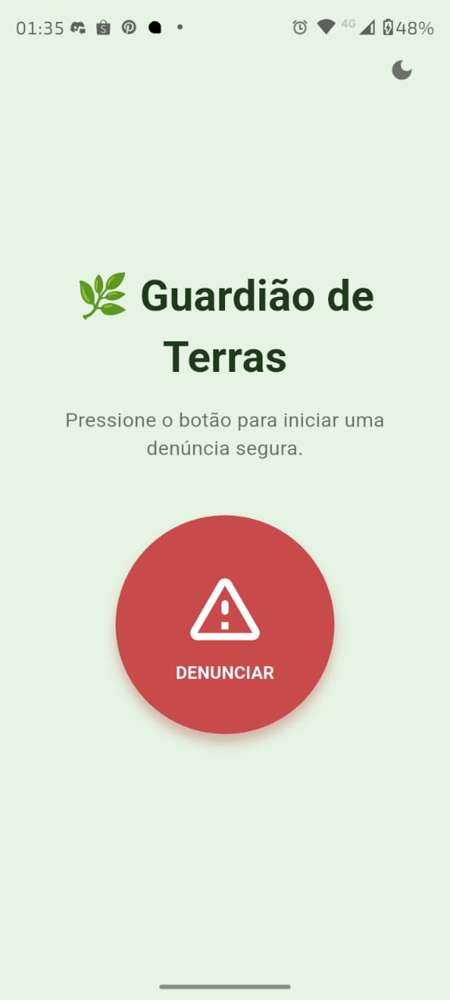
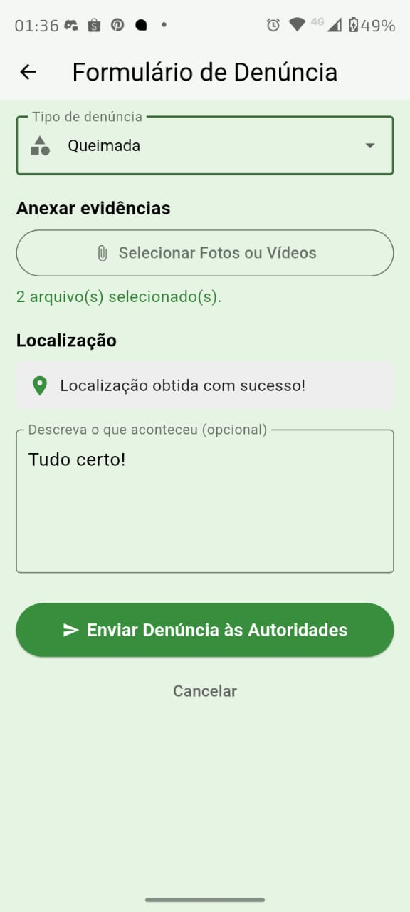
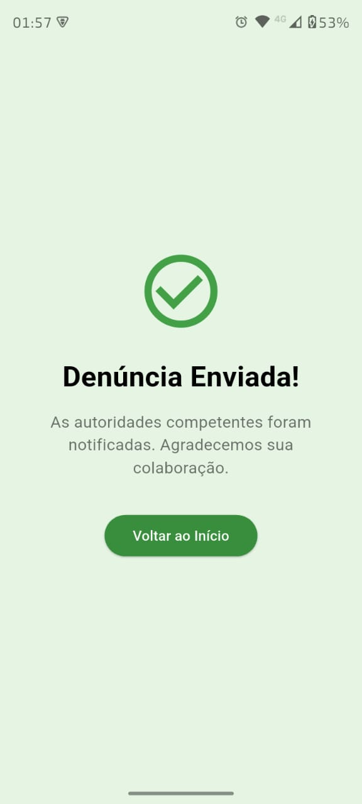
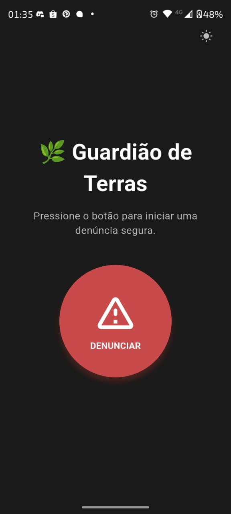
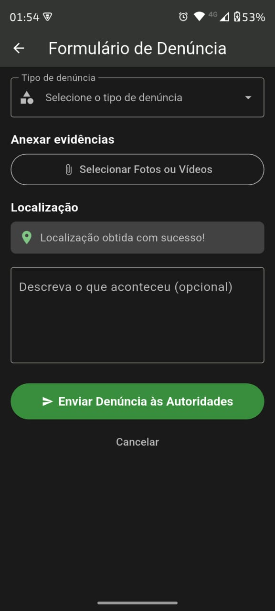
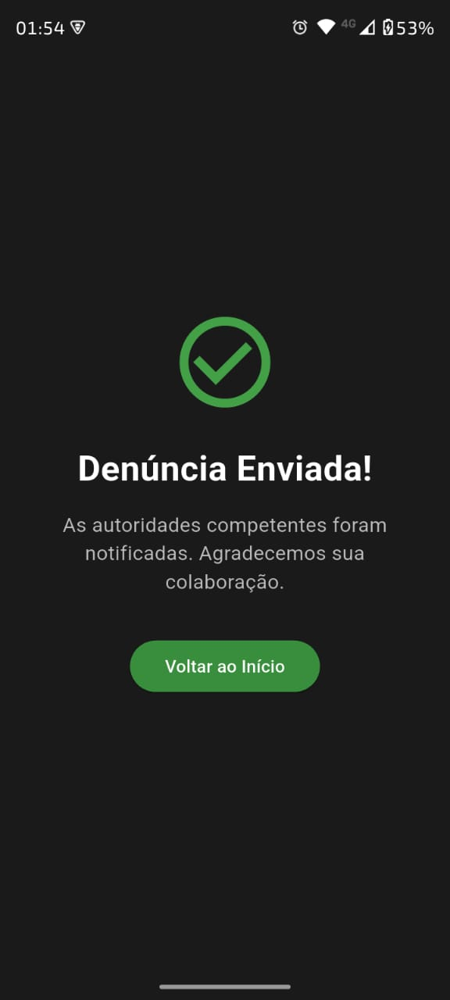

# 🌿 Guardião de Terras

Protótipo de aplicativo móvel para denúncias em territórios indígenas, desenvolvido como parte do trabalho acadêmico da disciplina de Humanidades e Cidadania (FGA0164) da Universidade de Brasília (UnB - FCTE).

## 📄 Sobre o Projeto

O "Guardião de Terras" é uma prova de conceito que explora como tecnologias modernas podem auxiliar na conservação da cultura e na proteção dos povos indígenas. O aplicativo foi projetado com uma interface minimalista e de fácil acesso, permitindo que membros da comunidade possam registrar e enviar denúncias de forma rápida e segura para as autoridades competentes.

O objetivo principal é oferecer uma ferramenta que fortaleça a autonomia e a segurança das comunidades, servindo como uma ponte direta para órgãos de proteção ambiental e de direitos humanos.

## ✨ Funcionalidades Principais

* **Interface Simplificada:** Uma tela inicial com um único botão de ação para eliminar qualquer complexidade.
* **Formulário Estruturado:** Coleta de informações essenciais, como tipo de denúncia, descrição, evidências e localização.
* **Anexo de Múltiplas Evidências:** Permite ao usuário anexar várias fotos e vídeos para fortalecer a denúncia.
* **Geolocalização Automática:** Captura das coordenadas GPS para identificar com precisão o local da ocorrência.
* **Fluxo Intuitivo:** Navegação clara desde o início da denúncia até a confirmação de envio.

## 📱 Telas do Aplicativo (Tema claro)

| Tela Inicial | Formulário |
| :---: | :---: |
|  |  |
| **Confirmação de Envio** |
|  |

## 📱 Telas do Aplicativo (Tema escuro)

| Tela Inicial | Formulário |
| :---: | :---: |
|  |  |
| **Confirmação de Envio** |
|  |

## 🛠️ Tecnologias Utilizadas

Este protótipo foi desenvolvido utilizando as seguintes tecnologias:

* **[Flutter](https://flutter.dev/)**: Framework do Google para criar aplicativos multiplataforma (Android e iOS) com uma única base de código.
* **[Dart](https://dart.dev/)**: Linguagem de programação utilizada pelo Flutter, otimizada para a criação de interfaces de usuário rápidas.

## 🚀 Começando

Siga estas instruções para obter uma cópia do projeto e executá-lo em sua máquina local para fins de desenvolvimento e teste.

### Pré-requisitos

* Você precisa ter o **[Flutter SDK](https://docs.flutter.dev/get-started/install)** instalado em seu computador.
* Um emulador (Android/iOS) ou um dispositivo físico conectado.

### Instalação

1.  **Clone o repositório:**
    ```sh
    git clone https://github.com/thaleseuflauzino/guardiao_das_terras.git
    ```

2.  **Navegue até a pasta do projeto:**
    ```sh
    cd guardiao-das-terras
    ```

3.  **Adicione as dependências:**
    Abra o arquivo `pubspec.yaml` e garanta que as seguintes dependências estejam na seção `dependencies`:
    ```yaml
    dependencies:
        flutter:
            sdk: flutter
                file_picker: ^8.0.0+1
                geolocator: ^13.0.1
                cupertino_icons: ^1.0.8
    ```

1.  **Instale os pacotes:**
    Execute o seguinte comando no terminal para baixar e instalar todas as dependências do projeto.
    ```sh
    flutter pub get
    ```
    *Nota: A configuração de permissões para acesso a arquivos e localização GPS precisa ser feita nos arquivos de configuração nativos (`AndroidManifest.xml` para Android e `Info.plist` para iOS) para um aplicativo de produção.*

2.  **Execute o aplicativo:**
    ```sh
    flutter run
    ```

## 👥 Autores

Este projeto foi realizado pelos seguintes alunos:

* Thales Henrique Euflauzino Dos Santos
* Victor Hugo Lima Schmidt
